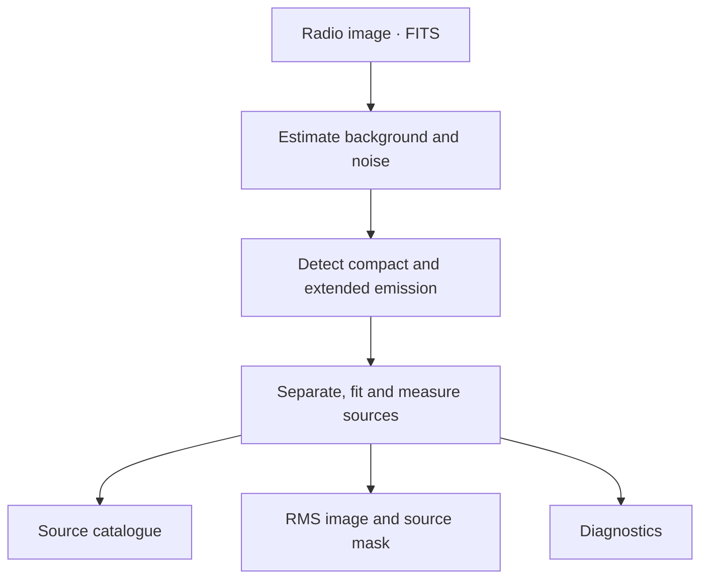

# Hebog

[](.github/workflows/ci.yaml)
[](release-please-config.json)
[](https://gemmadanks.github.io/hebog/)
[](https://codecov.io/gh/gemmadanks/hebog)
[](LICENSE)

Hebog is an **experimental** radio-continuum source finder with serial and
Dask execution for scientific workflows and data pipelines.



Hebog turns a radio image into measured sources and supporting image products,
using serial execution or an existing Dask cluster.

## Status

Hebog is under active development. APIs, configuration, and output formats may
change frequently, with no backward-compatibility guarantee between `0.x`
releases and no guaranteed deprecation period. Breaking changes are documented
in release notes and the current documentation. Pin an exact version for
reproducible workflows and review the release notes before upgrading.

The finder implements FITS/WCS ingestion, background/RMS estimation,
compact and multiscale detection, Gaussian-component and associated-source
measurements, and atomic catalogue, RMS, mask and diagnostic products. Use
Serial execution or supply an existing Dask client.

Hebog is released in tested experimental `0.x` increments. Published
versions are listed in [GitHub releases](https://github.com/gemmadanks/hebog/releases).

## Goal

Hebog's main goal is to provide a scalable and performant alternative to PyBDSF
in the Rapthor self-calibration pipeline, which includes source finding in order to filter a
sky model generated by an imaging step for the following calibration step. It
uses Dask to distribute

Complete compatibility with every PyBDSF option, polarization analysis not
used by Rapthor, GPU execution, and undocumented PyBDSF defects are for now
out of scope.

## Public API contract

The scheduler-independent API is designed around small, serializable requests
and materialised results:

```python
from pathlib import Path

from hebog import SourceFinderConfig, SourceFinderRequest, find_sources
from hebog.executors import SerialExecutor

request = SourceFinderRequest(
    image_path=Path("image.fits"),
    output_directory=Path("output"),
    run_id="example",
)
config = SourceFinderConfig(
    detection_threshold_sigma=5.0,
    island_threshold_sigma=3.0,
    minimum_island_pixels=7,
)
result = find_sources(request, config, SerialExecutor())
```

The top-level call outputs a source catalogue, RMS image,
source-filtering mask, and diagnostics. It
accepts ICRS `Jy/beam` images up to 1,024 pixels on either spatial axis.
The
[public tutorial](docs/tutorials/find-sources.md) explains profiles, products,
unavailable measurements and retries.

Requests and results never contain open FITS handles, scheduler clients, or
mutable full-image objects. Scientific thresholds are explicit because the
widely used 5-sigma/3-sigma profile is not a universal default. One public
request analyses one image and returns one catalogue, RMS image, mask, and
diagnostics record. The `hebog.adapters.rapthor` boundary composes the
primary-beam-corrected and flat-noise branches and owns Rapthor-specific sky
models, filenames, and compatibility options. Rapthor owns the top-level Dask
graph and resource budget.

## Development setup

Python 3.12 through 3.14 is supported.

Install [uv](https://docs.astral.sh/uv/getting-started/installation/), clone the
repository, and install all dependency groups:

```shell
git clone https://github.com/gemmadanks/hebog.git
cd hebog
uv sync --all-groups
```

Install [just](https://just.systems/) to use the repository's documented
commands:

```shell
just test-unit          # fast deterministic tests
just test-integration   # Dask and FITS integration tests
just test-equivalence   # frozen PyBDSF comparisons
just test-acceptance    # Rapthor-facing behaviour scenarios
just test-qualification # held-out scientific validation
just test-benchmark     # explicitly requested performance tests
just test-scalability   # controlled large-image and multi-node scale tests
just marimo-check       # validate Marimo notebooks
just check              # format, lint, type, and quick tests
just docs-build         # strict MkDocs build
just package-smoke-test # build and import the wheel in isolation
```

Small equivalence and acceptance suites are suitable for pull requests.
Qualification and benchmark lanes are explicit because they may require held-
out data, stable CPU allocation, or external PyBDSF, LSMTool, and Rapthor
environments.

## Interactive demonstrations

Start with the complete public source-finder example:

```shell
uv run marimo edit notebooks/source_finder_demo.py
```

It generates a small synthetic shell, calls `hebog.find_sources`, and reads
and displays the published catalogue, RMS, mask and diagnostics. The
astronomer's workbench adds image and threshold controls; the internals
notebook demonstrates algorithms and tiling; the comparison notebook displays
saved campaign results.

See [Use the notebooks](docs/how-to/notebooks.md) for all four notebooks,
public-data downloads, saved comparison prerequisites and refresh commands.
Use `just marimo-check` for structure checks and `just notebook-smoke` to
execute the two offline examples. Neither enforces identical experiment
results across notebook runs.

## Architecture

Scientific kernels operate on NumPy arrays and immutable configuration.
Serial and existing-client Dask executors run coarse work; Zarr is the sole
intermediate image-plane backend, with FITS at ingress and final publication.
Bounded stages use explicit tile cores, halos and global ownership.

The complete public finder still materializes a bounded preview plane and
rejects inputs above its 1,024-pixel limit. Persistent local threads,
resource-based batching, fully bounded terminal measurement/publication and
facility qualification remain in the plan. The target is 100,000-square
images across 100 to several hundred nodes without a full plane on a worker;
that scale is not yet established.

Dependencies point inward from workflow and compatibility adapters to the
public pipeline and scientific core. Hebog favours Pythonic, typed, cohesive
code and narrow demonstrated extension seams over framework-specific coupling
or a speculative plugin system. See the
[quality attributes and coding principles](docs/explanation/quality-attributes.md).

Hebog does not currently need a project-owned C++ or Rust extension. The
[native-code assessment](docs/explanation/native-code-assessment.md) keeps
NumPy/SciPy and profiled Numba as the first choices, with quantitative gates
for reconsidering Rust or C++ after end-to-end profiling.

## Repository layout

- `src/hebog/`: library, CLI, public records, execution policies, algorithms,
  and I/O boundaries.
- `tests/`: unit, integration, scientific-equivalence, acceptance,
  qualification, and benchmark suites.
- `scripts/benchmark/`: reproducible PyBDSF, Hebog, and Rapthor benchmarks.
- `config/`: checked-in algorithm, equivalence, and benchmark configurations.
- `notebooks/`: reproducible interactive demonstrations.
- `docs/`: user, reference, explanation, and architecture documentation.
- `plans/source-finder-implementation.md`: authoritative delivery plan and
  acceptance gates.
- `LOG.md`: chronological execution progress, evidence, decisions, and next
  steps.

## Contributing

Use [Conventional Commits](https://www.conventionalcommits.org/) and follow
[AGENTS.md](AGENTS.md). A scientific or performance change must include the
relevant equivalence evidence; isolated kernel timings are not sufficient for
an end-to-end speedup claim. Code must pass the configured Ruff, Pyright,
coverage, and test gates. Significant architectural decisions belong in an ADR
under `docs/architecture/adr/`.

## Citation and license

If Hebog contributes to research, cite it using [CITATION.cff](CITATION.cff).
Hebog is distributed under the [BSD 3-Clause License](LICENSE).
