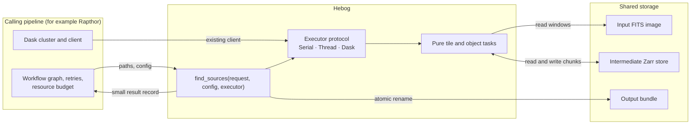
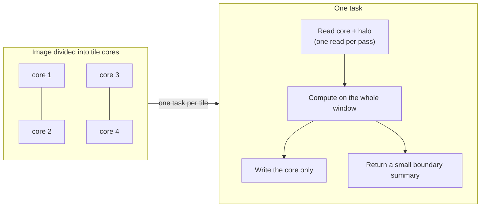
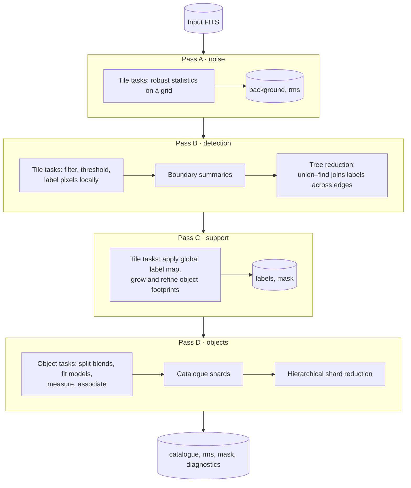

# How Hebog distributes work

This page is for architects and pipeline developers. It explains how Hebog
splits one image into independent tasks, what crosses the network, and which
guarantees hold when the work runs on many machines. It assumes no radio
astronomy background. The decisions behind it are recorded in
[ADR-004](adr/004-keep-top-level-scheduling-in-rapthor.md),
[ADR-005](adr/005-scale-large-images-with-hierarchical-tiles.md),
[ADR-007](adr/007-use-zarr-for-intermediate-image-storage.md) and
[ADR-008](adr/008-make-the-continuum-composition-tile-native.md).

!!! note "Current status"
    Every scientific step already runs as tiled tasks through an executor and
    exchanges image planes through Zarr. The public API still limits images
    to 1,024 pixels per side, because the driver still assembles some complete
    planes. Inside that limit every image is a single tile. The design target
    is 100,000 × 100,000 pixels on hundreds of nodes; scale beyond one machine
    has not been demonstrated yet.

## The problem in one paragraph

A source finder turns an image into a table of objects. Most of the work is
local: the answer for one pixel depends only on pixels within a fixed
distance. A few steps are global: an object can be larger than any fixed
distance, and two detections far apart can belong to the same object. A
100,000 × 100,000 image of 64-bit values is 80 GB per plane, and the pipeline
needs several planes, so no single worker can hold the image. Hebog therefore
makes the local work embarrassingly parallel and reduces the global work to
small records.

## Who owns what



- **The caller owns the cluster.** Hebog never creates a Dask cluster, a
  process pool or a client. The caller passes an executor:
  `SerialExecutor`, `ThreadExecutor`, or `DaskExecutor(client)` wrapping a
  client it already owns.
- **Hebog owns the science.** The same code path runs under every executor.
  `SerialExecutor` is the reference; the others must reproduce its output.
- **Storage carries pixels; the scheduler carries records.** Tasks read
  windows of the input and read or write Zarr chunks. Task arguments and
  results are small serializable records. No image-sized array is sent through
  the scheduler or gathered on the driver.

## Tiles, cores and halos

Hebog divides the image into a grid of **tiles**. Each tile has:

- a **core**: the pixels this tile is responsible for. Cores do not overlap
  and together cover the image exactly once; and
- a **halo**: a read-only margin of neighbouring pixels, wide enough for the
  current stage to compute correct values at the core's edge.



Each stage declares the smallest halo that makes its output exact. A
smoothing filter needs a halo as wide as its kernel; labelling connected
pixels needs none, because it reports what touches the edge instead. The
[per-stage contract](adr/008-make-the-continuum-composition-tile-native.md#per-stage-contract)
lists every halo.

Three rules make the result independent of how the image was tiled:

1. **Cores own pixels.** A task writes only its core, so no two tasks write
   the same pixel and no merge of overlapping pixels is needed.
2. **A canonical pixel owns each object.** A detected object belongs to the
   core containing its first pixel in row-major order. Its identifier is a
   hash of that global pixel position, so it does not depend on tile layout,
   worker count or completion order.
3. **Derived grids are anchored to the image, not to the tiles.** Moving the
   tile grid changes which task computes a value, never the value.

A small image is simply one tile with an empty halo. There is no separate
"small image" code path.

## Passes: where the global steps go

The pipeline runs as four **passes**. Within a pass all tile tasks are
independent. A pass ends only where a global reduction must finish before any
later decision can be made.



| Pass | Unit of work | Global step at its end |
| --- | --- | --- |
| A · noise | tile | none; grid cells are disjoint |
| B · detection | tile | join connected regions that cross tile edges |
| C · support | tile, then one object's window | decisions scoped to one object, applied back per tile |
| D · objects | one object's bounding window | group interacting objects, reduce catalogue shards |

### Joining objects across tile edges

A tile labels connected pixels using local integers. It then reports, for each
label that touches an edge, which pixels it touches and a few additive
aggregates (pixel count, sum, bounding box, first pixel). A union–find
reduction joins labels that meet across an edge. The reduction runs as a tree,
so no node sees every summary at once. The resulting global label map is
**sharded**: each tile receives only the entries for labels it contains.

### Objects larger than a halo

From pass C onwards some work is scoped to one object instead of one tile. The
task reads the window that contains the whole object, makes the decision once,
and returns a small record or patch that the tile tasks then apply to the
cores they own. The decision therefore cannot depend on where tile boundaries
fall. Objects that exceed a hard size bound are published as one explicitly
deferred detection instead of consuming unbounded memory.

## The executor contract

Hebog's scientific code depends on a three-member protocol, not on Dask:

```python
class Executor(Protocol):
    @property
    def capacity(self) -> ExecutorCapacity: ...
    def map_batches(self, function, batches, *, requirement=None) -> list: ...
    def reduce_batches(
        self, function, batches, combine, *, requirement=None
    ): ...
```

All executors obey the same rules, so a defect shows up on a laptop under
`SerialExecutor` rather than only on a cluster:

- Results follow input order, whatever order tasks complete in.
- `reduce_batches` combines results in a tree fixed by input index, so even
  floating-point sums do not depend on completion order. `DaskExecutor` runs
  the combines on workers and gathers one value.
- Payloads must be serializable. Every executor checks this before submitting,
  so a lambda or an open file fails immediately, even serially.
- Submission is bounded by `capacity.maximum_tasks_in_flight`. A
  `TaskRequirement` (memory and threads) narrows that bound and is refused up
  front if one task cannot fit one worker.
- Tasks are idempotent, so a `retry_limit` above zero is safe.

Tasks are **coarse batches** of tiles or objects. Graph size scales with the
number of tiles and stages, never with pixels or detected objects, which keeps
scheduler overhead bounded.

## Storage

| Data | Format | Why |
| --- | --- | --- |
| Input image | FITS | The community interchange format. Workers read only the window they need. |
| Intermediate planes | Zarr v3 | Chunked, so tasks read and write independent pieces concurrently. One chunk per tile core. It is the only intermediate backend. |
| Published products | FITS and JSON | Compatibility with astronomy tools. Written privately, validated, then moved into place with one atomic rename. |

Only planes that a later pass or a product needs are stored. Filter responses
and other transient arrays stay in task memory. Science planes are `float64`;
a 2,048-pixel core with its halo is about 42 MB per plane, so a task holding
ten planes needs roughly 420 MB whatever the image size.

On a multi-node cluster, the input image and the parent of the output
directory must be on storage every worker can reach with the same absolute
path.

## Guarantees and how they are tested

| Guarantee | Level | Evidence |
| --- | --- | --- |
| Labels, masks, identifiers, catalogue membership and ordering do not depend on tile shape, partition origin, worker count, task order or retries | exact | contract and partition-invariance tests, including sources placed on tile edges and corners |
| Continuous filter responses agree across tilings | within 2 × 10⁻¹³ | multiscale partition-equivalence tests, with knife-edge threshold cases |
| Serial, thread and Dask execution publish the same products | byte-identical scientific products | the shared executor contract suite |
| A failed run leaves no partial output | — | write-then-rename publication; the run can be retried with the same request |

## What is not decided here

Hebog does not choose worker counts, memory limits, spill policy or task
placement; those belong to the cluster's owner. It attaches no Dask resource
annotations. Tile core size is chosen from the memory the caller admits and
may change batching, never results.

See [Integrate Hebog into a pipeline](../how-to/integrate-into-a-pipeline.md)
for the practical steps.
