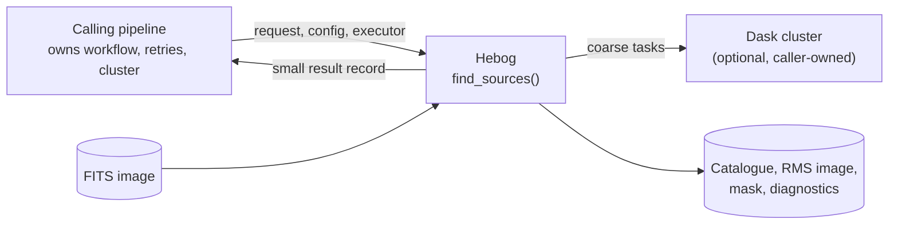
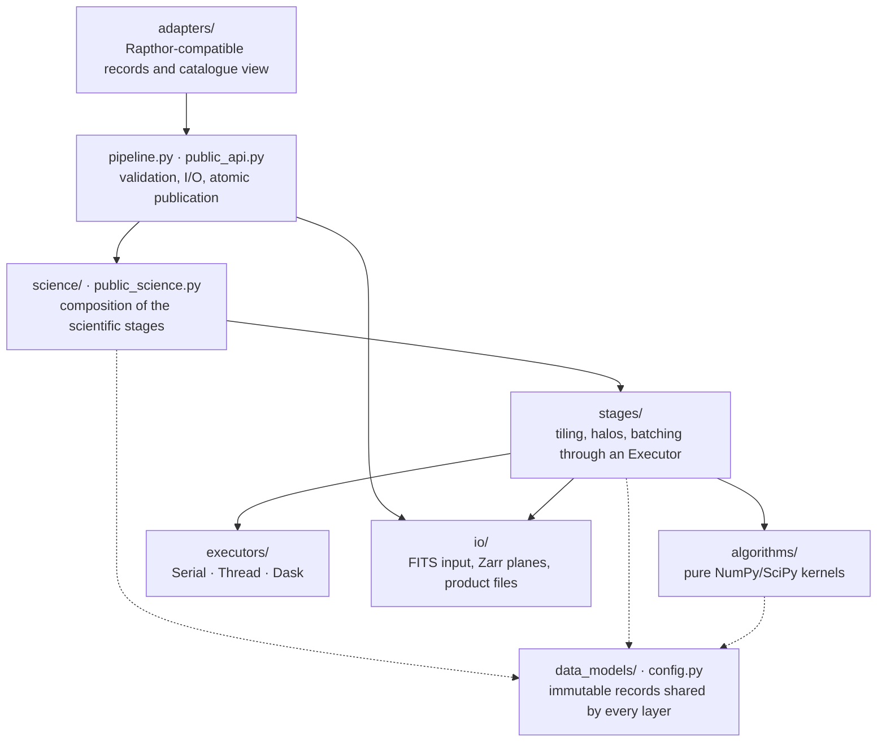

# Architecture overview

This section is for developers and architects. It does not assume radio
astronomy knowledge; the [glossary](../reference/domain-glossary.md) defines
domain terms. Astronomers looking for the algorithms should read
[How Hebog finds sources](../explanation/how-hebog-works.md).

## What Hebog is

Hebog is a Python library with one public operation:

```python
result = hebog.find_sources(request, config, executor)
```

It reads one astronomical image (a FITS file), finds the objects in it, and
writes a catalogue, a noise image, a mask and a diagnostics file. It is
designed to be embedded in a larger data-processing pipeline that already owns
a Dask cluster. Its first intended consumer is
[Rapthor](https://github.com/darafferty/rapthor), a LOFAR imaging pipeline,
where it would replace [PyBDSF](https://github.com/lofar-astron/PyBDSF) in one
step. That integration is not implemented yet.

## Quality goals

| Priority | Goal | Consequence |
| --- | --- | --- |
| 1 | **Scientific equivalence** with what the consuming pipeline needs | Serial execution is the reference; every other mode must reproduce it |
| 2 | **Scalability** to 100,000 × 100,000-pixel images on hundreds of nodes | No step may need a whole image on one worker |
| 3 | **Performance**: the complete pipeline step at least 50% faster than the PyBDSF reference | Measured end to end, never from isolated kernels |
| 4 | **Interoperability** with any pipeline | No dependency on Rapthor, Prefect or LSMTool; Dask is imported only when a Dask executor is requested |
| 5 | **Maintainability** | Pure functions, immutable records, inward-pointing dependencies |

[Quality attributes and coding principles](../explanation/quality-attributes.md)
gives the rationale and the enforced gates.

## System context



Hebog analyses one image per call. Scheduling across images, retries, resource
budgets, and any translation into another tool's file conventions belong to
the caller. The [domain model](../explanation/domain-model.md) shows the
wider Rapthor context.

## Layers

Dependencies point inward. An inner layer never imports an outer one.



| Layer | Responsibility | Must not |
| --- | --- | --- |
| `algorithms/` | Arrays and immutable configuration in, arrays or records out | know about schedulers, files or adapters |
| `stages/` | Wrap each kernel with tiles, halos and coarse batches | hold scheduler-specific objects |
| `science/` | Compose stages into the reviewed scientific pipeline | depend on adapters or a concrete scheduler |
| `public_api.py` | Validate input, plan tiles, run the composition, publish products atomically | leak open files or arrays into results |
| `executors/` | Run batches serially, on threads, or on a caller-owned Dask client | create clusters |
| `io/` | FITS windows in, Zarr intermediate planes, FITS and JSON products out | — |
| `adapters/` | Translate to a consumer's names and formats | be imported by inner layers |

Importing `hebog` performs no I/O and does not import Dask; `DaskExecutor`
loads only when requested. `hebog.validation` is development tooling and is
excluded from wheels.

## Key decisions

| Decision | Record |
| --- | --- |
| The caller owns scheduling; Hebog accepts an executor | [ADR-004](adr/004-keep-top-level-scheduling-in-rapthor.md) |
| Large images are split into tiles with halos and reconciled hierarchically | [ADR-005](adr/005-scale-large-images-with-hierarchical-tiles.md), [ADR-008](adr/008-make-the-continuum-composition-tile-native.md) |
| Zarr is the only intermediate image store; FITS is for input and final products | [ADR-007](adr/007-use-zarr-for-intermediate-image-storage.md) |
| Internal schemas are versioned; compatibility formats live in adapters | [ADR-006](adr/006-isolate-compatibility-with-versioned-schemas.md) |
| Scope is limited to what the first consumer needs | [ADR-003](adr/003-limit-hebog-to-rapthor-source-finding-contract.md) |
| Native code only after measured gates | [Native-code assessment](../explanation/native-code-assessment.md) |

All records are in the [ADR index](adr/index.md).

## Where to go next

- [How Hebog distributes work](distributed-execution.md): tiles, passes,
  executors, storage and invariance guarantees.
- [Integrate Hebog into a pipeline](../how-to/integrate-into-a-pipeline.md).
- [Domain model](../explanation/domain-model.md): system boundary and
  ownership in the Rapthor context.
- [Implementation plan](https://github.com/gemmadanks/hebog/blob/main/plans/source-finder-implementation.md):
  current state, milestones and gates.
