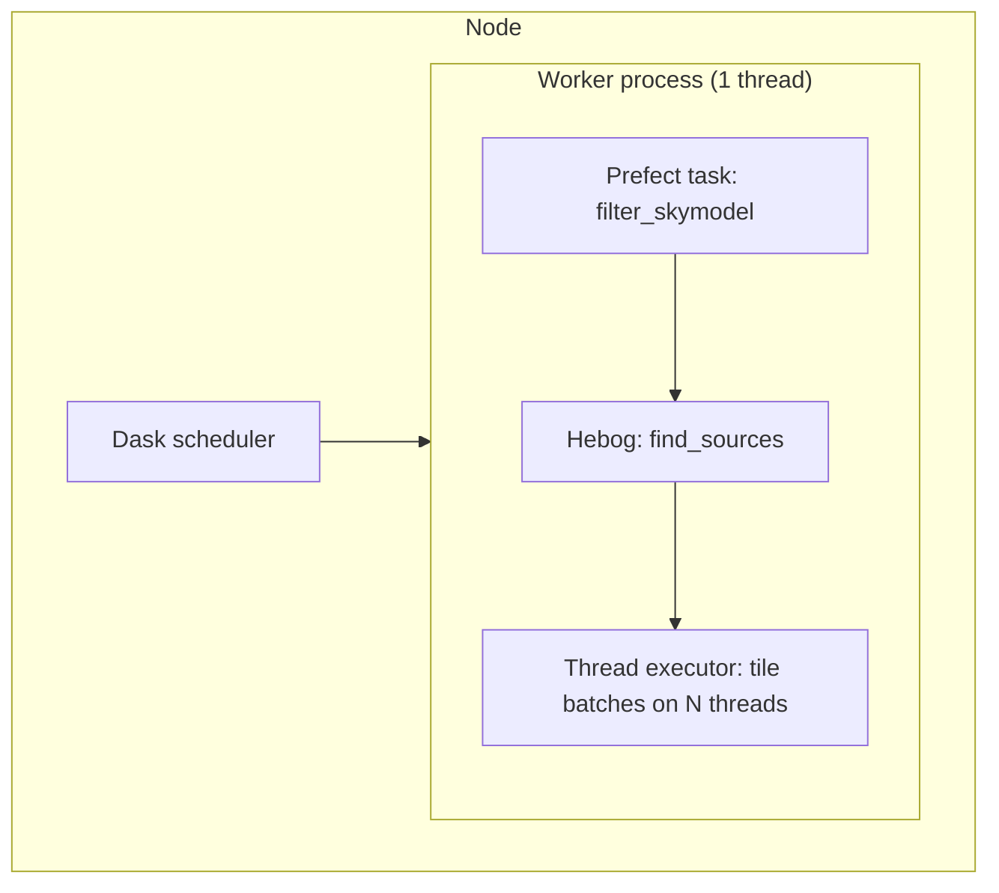
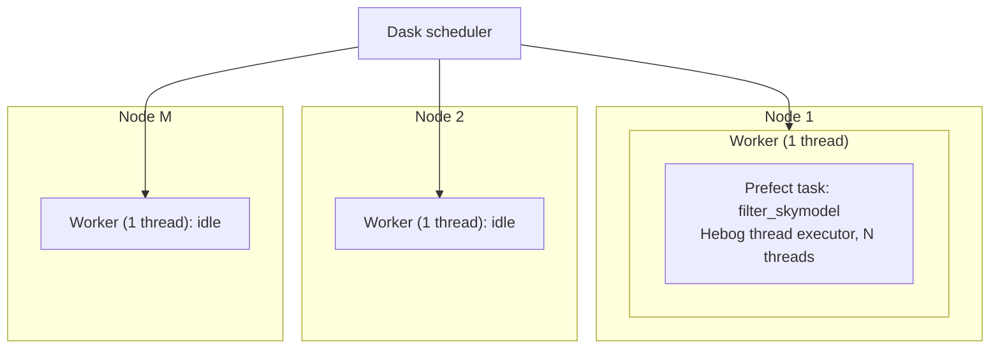
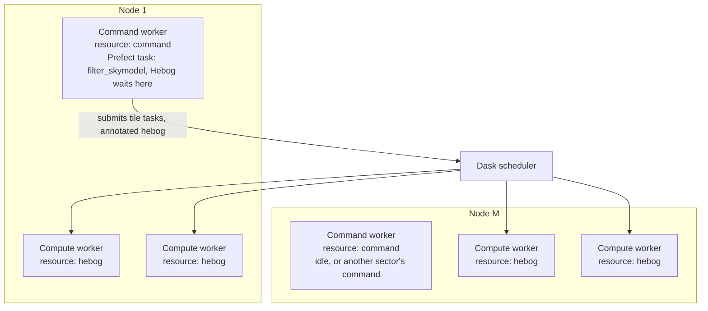

# How Hebog runs on Rapthor's Dask layouts

This page shows where one Rapthor sector's source finding runs on each Dask
layout Rapthor can start, and which Hebog executor it uses. Rapthor
orchestrates several sectors, so every layout here holds one sector. The
decision behind it is the amendment of 10 October 2026 to
[ADR-004](adr/004-keep-top-level-scheduling-in-rapthor.md); the
[Rapthor contract](../reference/rapthor-source-finding-contract.md#how-hebog-runs-inside-rapthor)
records the interface.

In every layout, Rapthor's Prefect `filter_skymodel` task calls Hebog
in-process on the Dask worker that runs it, then LSMTool's `filter_sources`.
Hebog never starts a cluster or a process pool. Rapthor starts its workers
with one thread each, because Prefect cannot run two tasks safely in one
worker process; a node's cores therefore reach Hebog either as threads
inside that one task, or as more worker processes.

| Layout | Hebog's executor | Cores one sector can use | Status |
| --- | --- | --- | --- |
| 1. One node, one worker | Thread executor in the task | One node's, limited by Python's global lock | Rapthor's `local_dask` today |
| 2. One node, several workers | Rapthor's client | One node's, one per worker process | `local_dask_workers` today, without the safeguards below |
| 3. Several nodes, one worker each | Thread executor in the task | One node's; the others wait | Rapthor's `external_dask` today |
| 4. Several nodes, a command worker and compute workers each | Rapthor's client | Every compute worker's | Recommended target |

## 1. One node, one worker

Rapthor's `local_dask` default starts one worker process with one thread.
Hebog runs a thread executor inside the filter task, sized to the node's
cores. There is no scheduler traffic, which suits small and medium images,
but every thread shares one Python process, so stages that run Python
rather than NumPy and SciPy code do not scale with the threads.

This is also how Hebog runs standalone on a local machine, with the Serial
or Thread executor and no Dask at all.

## 2. One node, several workers

With `local_dask_workers` set, Rapthor starts several single-threaded
worker processes on the node. Hebog runs on Rapthor's client: the filter
task submits tile tasks, and Dask places them on every worker, so separate
processes avoid the global lock.

As Rapthor sets it up today, two things go wrong in this layout. The
waiting filter task holds its worker's only thread, so Hebog must step out
of the slot (`secede`) while it waits, or several sectors could leave no
thread free for their tile tasks. And nothing stops Rapthor from running a
DP3 or WSClean command, which expects the whole node, on another worker at
the same time. Layout 4 removes both.

## 3. Several nodes, one worker each

Rapthor's `external_dask` layout runs one single-threaded worker a node.
Through Dask, Hebog would get one tile task a node at a time, so it runs a
thread executor inside the filter task instead, as in layout 1, and the
other nodes wait while the sector is filtered.

## 4. Several nodes, a command worker and compute workers each (recommended)

Each node runs one command worker, single-threaded as Prefect needs, for
Rapthor's Prefect tasks and its whole-node commands, and several compute
workers for Hebog's tile tasks only. Dask resources keep the two apart:
Rapthor's tasks require the command worker's `command` resource and Hebog's
tile tasks require the compute workers' `hebog` resource. Compute workers
never run a Prefect task, so each may run a few threads; several such
processes a node, rather than one with every core, keep the global lock
from throttling it. The filter task waits on its command worker while its
tiles run on the compute workers, so it cannot starve them, and a node's
command slot holds one whole-node command at a time.

On one node this is layout 2 with the two safeguards. Hebog sizes its tile
cores from the compute capacity the client reports, so each stage has a few
tasks per core, while a small image stays one tile. How far one sector
gains from more compute workers depends on the share of its run that does
not parallelise, which the plan measures and reduces first (tasks 73 and
74); beyond that point, the compute workers serve other sectors.

## Adding workers during a Prefect flow

Dask lets workers join or leave a running scheduler at any time:
`LocalCluster.scale` and `adapt` change a local cluster's worker count, a
`dask worker` process started later joins an external scheduler, and
`Client.retire_workers` removes workers gracefully. A worker's thread count
and resources are fixed when it starts, so more cores means more workers,
not more threads in an existing one. Rapthor holds its local cluster's
handle and could scale it around the filter step.

Starting the compute workers with the cluster is simpler, and is the
recommendation: idle workers cost only their memory, and Hebog sizes its
tiles from the capacity present when the analysis starts, so workers that
join mid-analysis receive tasks but do not change the tiling. Rapthor's
local cluster now gives every worker the whole node's `mem_per_node_gb` as
its memory limit; with compute workers, the node's memory must be divided
between them and the command worker (plan task 17).
