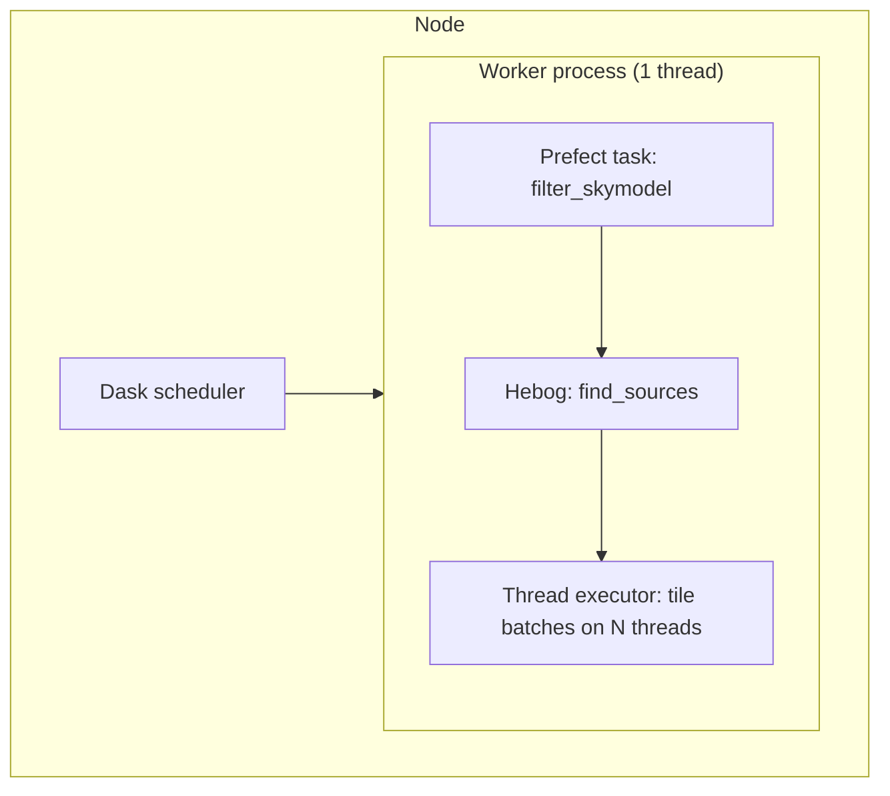
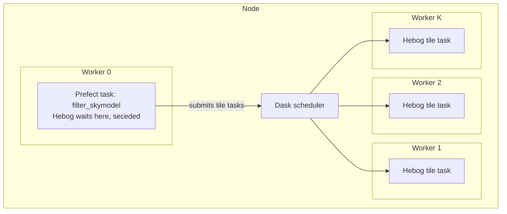
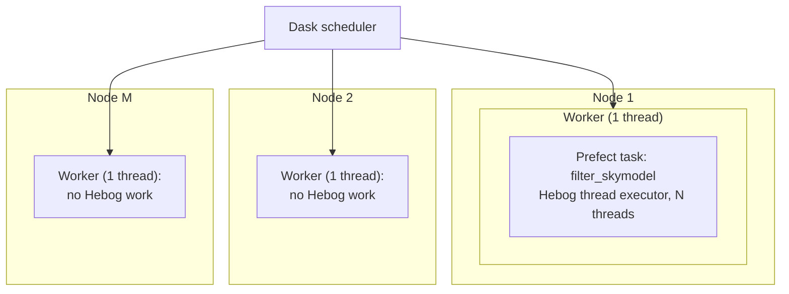
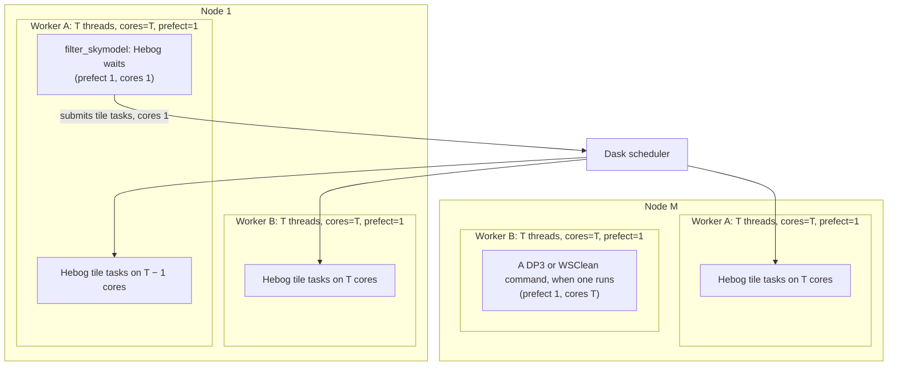

# How Hebog runs on Rapthor's Dask layouts

This page shows where one Rapthor sector's source finding runs on each Dask
layout Rapthor can start, and which Hebog executor it uses. Rapthor
orchestrates several sectors, so every layout here holds one sector. The
decision behind it is the amendment of 10 October 2026 to
[ADR-004](adr/004-keep-top-level-scheduling-in-rapthor.md); the
[Rapthor contract](../reference/rapthor-source-finding-contract.md#how-hebog-runs-inside-rapthor)
records the interface. Hebog defines what it needs from a Dask cluster to
scale, and Rapthor provides it ([ADR-010](adr/010-scale-hebog-independently-of-its-integrations.md)):
Rapthor owns its workers, and may change its current setup, its first one,
to run DP3, WSClean and Hebog together.

In every layout, Rapthor's Prefect `filter_skymodel` task calls Hebog
in-process on the Dask worker that runs it, then LSMTool's `filter_sources`.
Hebog never starts a cluster or a process pool. Rapthor starts its workers
with one thread each, because Prefect cannot run two tasks safely in one
worker process. A Dask worker runs as many tasks at once as it has threads,
so a node's cores reach Hebog either as threads inside the filter task, or
as Dask task slots: more workers, or more threads a worker.

| Layout | Hebog's executor | Cores one sector can use (192-core nodes) | Status |
| --- | --- | --- | --- |
| 1. One node, one worker | Thread executor in the task | Up to 192, in one Python process | Rapthor's `local_dask` today |
| 2. One node, several single-threaded workers | Rapthor's client | One per worker | `local_dask_workers` today, with two problems |
| 3. Several nodes, one single-threaded worker each | Thread executor in the task | Up to 192, on one node; on the client, one per node | Rapthor's `external_dask` today |
| 4. Several workers a node, each with several threads | Rapthor's client | Every core no other task holds, on every node | One way for Rapthor to provide what Hebog needs |

## What Hebog needs from any cluster

Hebog asks the same of every cluster, Rapthor's or one a standalone user
starts: a client it does not own; worker task slots, across processes and
nodes, which are its parallelism; storage every worker can read; and a way
to say what its tasks use. Its tile tasks each use one core and an admitted
amount of memory, and carry Dask resource annotations whose names the
caller configures. Hebog sizes its tiles from the capacity the client
reports when an analysis starts, and assumes nothing about the rest of the
cluster.

## 1. One node, one worker

Rapthor's `local_dask` default starts one worker process with one thread.
Hebog runs a thread executor inside the filter task, sized to the node's
cores. There is no scheduler traffic, which suits small and medium images,
but every thread shares one Python process, so stages that run Python
rather than NumPy and SciPy code do not gain from more threads.

This is also how Hebog runs standalone on a local machine, with the Serial
or Thread executor and no Dask at all.

## 2. One node, several single-threaded workers

With `local_dask_workers` set, Rapthor starts several worker processes of
one thread each. Hebog runs on Rapthor's client: the filter task submits
tile tasks, and Dask places one on each free worker. Separate processes do
not share Python's global lock.

As Rapthor sets it up today, two things go wrong. The waiting filter task
holds its worker's only thread, so Hebog must step out of the slot
(`secede`) while it waits, or several sectors could leave no thread free for
their tile tasks. And Dask counts a DP3 or WSClean command as one task like
any other, so a command that uses many cores can run beside other commands
or Hebog's tiles on the same node. Layout 4 removes both.

## 3. Several nodes, one single-threaded worker each

Rapthor's `external_dask` layout runs one single-threaded worker a node.
Hebog has two choices, and neither uses the cluster:

- on Rapthor's client, every node's worker runs one tile at a time, so ten
  nodes run ten tiles in parallel: ten cores of 1,920;
- with a thread executor inside the filter task, up to 192 threads run on
  the node that holds the task, in one Python process, while the other
  nodes run nothing for Hebog.

Hebog uses the thread executor here, because one node's threads beat one
core a node.

## 4. Several workers a node, each with several threads

This is one way Rapthor can provide that beside its own tools; the choice
is Rapthor's. Every node runs several worker processes, for Hebog and for
Rapthor's own DP3 and WSClean commands alike. Each worker has T threads and declares two
Dask resources: `cores`, equal to T, and `prefect`, equal to 1. Every task
says what it uses:

| Task | Resources it requests | Effect on its worker |
| --- | --- | --- |
| A DP3 or WSClean command | `prefect: 1`, `cores: T` | Runs alone on the worker |
| Another Rapthor Prefect task | `prefect: 1`, the cores it uses | Never beside a second Prefect task |
| Rapthor's `filter_skymodel`, running Hebog | `prefect: 1`, `cores: 1` | Waits on one core, leaving T − 1 to tiles |
| A Hebog tile task | `cores: 1` | Runs on any free core of any worker |

`prefect: 1` keeps Rapthor's rule that one worker process runs one Prefect
task at a time, and `cores` stops a command from sharing its cores. A local
check with `distributed` 2026.7.1 on one four-thread worker showed both:
two Prefect tasks ran one after the other, four single-core tiles ran
together, two whole-worker commands ran one after the other, and a waiting
Prefect task left three cores to tiles.

Rapthor owns the rest. DP3's chunks change in number, size and memory with
each self-calibration cycle's solution intervals, so Rapthor may scale its
workers between steps; WSClean runs across nodes with MPI and needs few
Dask workers for now. The worker size T is a trade-off Rapthor chooses. DP3 and WSClean run as
external processes, so they use T cores without Python's global lock and
want T large. Hebog's tiles share one Python process per worker, so they
want T small enough that the lock does not throttle them; the plan's task
73 measures how far threads in one process scale. Hebog sizes its tile
cores from the cores the client reports, so each stage has a few tasks per
core, while a small image stays one tile. How far one sector gains from
more cores depends on the share of its run that does not parallelise,
which the plan measures and reduces first (tasks 73 and 74); beyond that
point, the cores serve other sectors.

## Adding workers during a Prefect flow

Dask lets workers join or leave a running scheduler at any time:
`LocalCluster.scale` and `adapt` change a local cluster's worker count, a
`dask worker` process started later joins an external scheduler, and
`Client.retire_workers` removes workers gracefully. A worker's thread count
and resources are fixed when it starts, so more cores means more workers,
not more threads in an existing one.

Scaling is Rapthor's decision, for example to give DP3 more or fewer
workers as its chunks change between self-calibration cycles. Hebog
tolerates it: it sizes its tiles from the capacity present when an analysis
starts, a worker that joins during an analysis receives tasks without
changing the tiling, and Dask reruns a task lost with its worker (the
plan's worker-loss acceptance scenario, task 19, is to show the products
unchanged). Scaling between steps rather than during Hebog's analysis
keeps its tiling matched to the cores it runs on. Rapthor's local cluster
now gives every worker the whole node's `mem_per_node_gb` as its memory
limit; with several workers a node, the node's memory must be divided
between them, and declared as a resource too (plan task 17).
