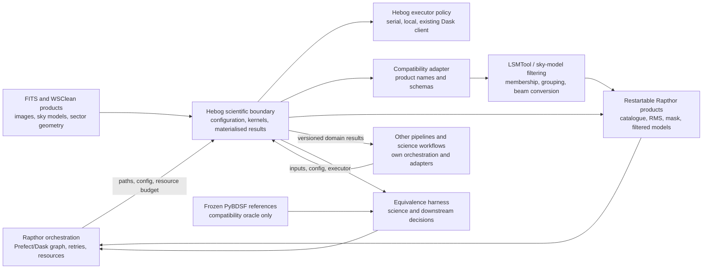
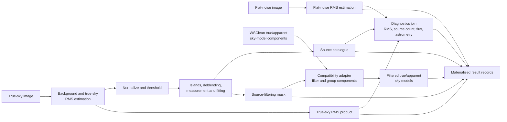
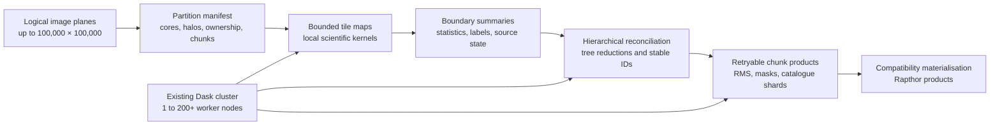

# Source-finding domain model

This page maps the stable boundaries around Hebog. It describes ownership and
data flow, not a detailed class design. The terms are defined in the
[domain glossary](../reference/domain-glossary.md), and current compatibility
behaviour is frozen in the
[Rapthor source-finding contract](../reference/rapthor-source-finding-contract.md).

## System context

Rapthor owns operation ordering, top-level Dask scheduling, retries, restart
state, and resource admission. Hebog owns scheduler-independent scientific
configuration and source-finding behaviour. It may use an executor for coarse
work, but it does not create a hidden cluster or send live scheduler state in
results.

Other pipelines and science workflows enter through the same public
scientific boundary and provide their own orchestration, executor, and product
adapter. Their integration code does not need Rapthor, Prefect, LSMTool, or
Dask objects when serial execution and Hebog's native products satisfy the
workflow.

The compatibility adapter is a boundary rather than a settled package. ADR-006
will decide its schema after frozen products and contract tests expose the
required mapping. PyBDSF remains a test oracle and feature-flagged fallback,
not a runtime dependency of Hebog's scientific kernels.

## Processing and data flow

The true-sky and flat-noise branches may execute concurrently only when
Rapthor admits their combined CPU and memory demand. Both produce files before
the diagnostics join, allowing retries and restarts without serializing image
objects through Dask.

## Large-image decomposition

ADR-005 makes the partition manifest part of the stable scientific boundary.
Every tile has a non-overlapping output core and a stage-specific read-only
halo. Local maps emit bounded boundary summaries; tree reductions reconcile
global statistics, connected labels, cross-scale sources, and stable
identifiers without gathering a full plane on the scheduler or one worker.
The one-tile path uses the same ownership and reconciliation rules as the
multi-node path.

The physical chunk store and final large-product materialisation format remain
Phase 0 and Phase 1 evidence-driven decisions. FITS compatibility at the
Rapthor boundary does not require every internal stage to rewrite a complete
FITS plane.

Production nodes are expected to have hundreds of GB of RAM. Executor policy
may use the admitted fraction for larger tile batches and bounded caches, while
retaining headroom for concurrent Rapthor work. Resource sizing changes
execution topology, not tile ownership or scientific results.

## Boundary invariants

- Scientific kernels accept arrays, immutable configuration, and explicit
  metadata; they do not import Rapthor or a global Dask client.
- Domain records, algorithms, and the public pipeline do not import Rapthor,
  Prefect, LSMTool, workflow adapters, or concrete scheduler implementations;
  adapters depend inward on the public scientific API.
- Image-sized kernels accept bounded tile cores, explicit halos, and global
  coordinates; no worker or public record requires a complete large plane.
- Source membership, stable identifiers, and materialised values are invariant
  to valid tile geometry, partition origin, worker count, task order, and
  retries within reviewed numerical tolerances.
- Production graph size is proportional to tiles and stages, never pixels,
  RMS windows, or small islands.
- Public task inputs and results contain paths and small serializable records.
- Apparent-sky, true-sky, flat-noise, RMS, residual, mask, catalogue, and
  filtered-model products remain distinguishable.
- Serial execution defines deterministic Hebog behaviour. Other executors
  match it before comparison with PyBDSF.
- Compatibility names remain at the adapter. They do not determine Hebog's
  internal algorithm or domain model.
- A product is not considered compatible until schema, units, empty behaviour,
  and downstream Rapthor decisions pass contract tests.

A detailed executor diagram is intentionally deferred until the asynchronous
executor contract stabilizes in Phase 6. The large-image decomposition above
records the stable data and ownership boundaries without fixing executor
classes or a physical chunk-store technology.
