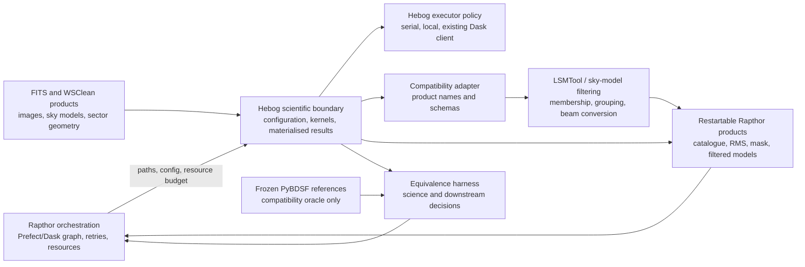
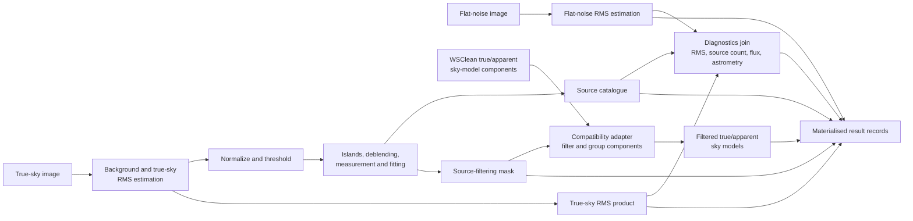

# Source-finding domain model

This page maps the stable boundaries around Hebog. It describes ownership and
data flow, not a detailed class design. The terms are defined in the
[domain glossary](../reference/domain-glossary.md), and current compatibility
behaviour is frozen in the
[Rapthor source-finding contract](../reference/rapthor-source-finding-contract.md).

## System context

Rapthor owns operation ordering, top-level Dask scheduling, retries, restart
state, and resource admission. Hebog owns scheduler-independent scientific
configuration and source-finding behaviour. It may use an executor for coarse
work, but it does not create a hidden cluster or send live scheduler state in
results.

The compatibility adapter is a boundary rather than a settled package. ADR-005
will decide its schema after frozen products and contract tests expose the
required mapping. PyBDSF remains a test oracle and feature-flagged fallback,
not a runtime dependency of Hebog's scientific kernels.

## Processing and data flow

The true-sky and flat-noise branches may execute concurrently only when
Rapthor admits their combined CPU and memory demand. Both produce files before
the diagnostics join, allowing retries and restarts without serializing image
objects through Dask.

## Boundary invariants

- Scientific kernels accept arrays, immutable configuration, and explicit
  metadata; they do not import Rapthor or a global Dask client.
- Public task inputs and results contain paths and small serializable records.
- Apparent-sky, true-sky, flat-noise, RMS, residual, mask, catalogue, and
  filtered-model products remain distinguishable.
- Serial execution defines deterministic Hebog behaviour. Other executors
  match it before comparison with PyBDSF.
- Compatibility names remain at the adapter. They do not determine Hebog's
  internal algorithm or domain model.
- A product is not considered compatible until schema, units, empty behaviour,
  and downstream Rapthor decisions pass contract tests.

A detailed executor diagram is intentionally deferred until the asynchronous
executor contract stabilizes in Phase 6.
