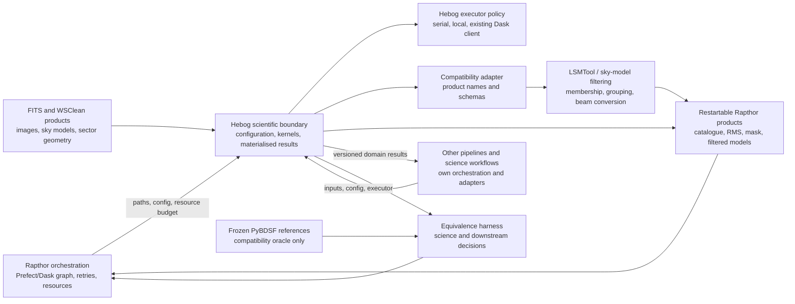
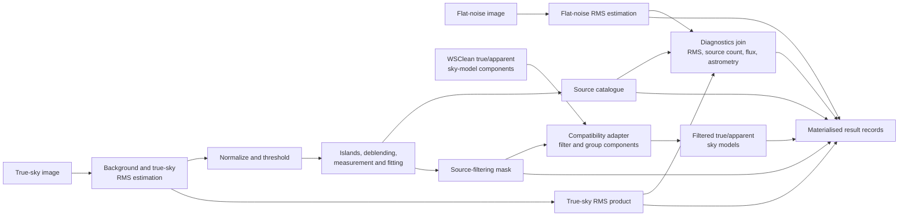
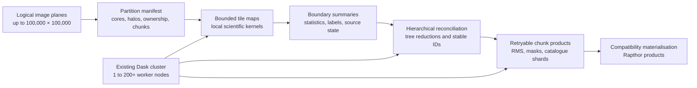

# Source-finding domain model

This page maps the boundaries around Hebog in its first intended deployment,
inside the Rapthor imaging pipeline: who owns what and what flows between
them, not class design. Start with the
[architecture overview](../architecture/index.md) if you are new to Hebog.

!!! note "Target design"
    The Rapthor integration shown here is the target. Today Hebog implements
    the standalone scientific boundary only; see
    [progress against goals](../reference/progress-against-goals.md#functionality).

Terms used below (the [glossary](../reference/domain-glossary.md) has the
rest):

- A **sky model** is the list of known sources a calibration pipeline uses to
  predict what the telescope should see. Rapthor's `filter_skymodel` step
  keeps only the entries that lie on detected emission, which is why it
  needs a source finder's mask.
- A **flat-noise** (apparent-sky) image has uniform noise but attenuated
  fluxes; a **true-sky** image has corrected fluxes but noise that rises
  towards the edge. Rapthor uses both.
- **PyBDSF** is the source finder Rapthor uses today; **LSMTool** manipulates
  its sky models.

## System context

```mermaid
flowchart LR
    R["Rapthor orchestration<br/>Prefect/Dask graph, retries, resources"]
    W["Other pipelines and science workflows<br/>own orchestration and adapters"]
    F["FITS and WSClean products<br/>images, sky models, sector geometry"]
    H["Hebog scientific boundary<br/>configuration, kernels, materialised results"]
    E["Hebog executor policy<br/>serial, local, existing Dask client"]
    A["Compatibility adapter<br/>product names and schemas"]
    L["LSMTool / sky-model filtering<br/>membership, grouping, beam conversion"]
    P["Restartable Rapthor products<br/>catalogue, RMS, mask, filtered models"]
    B["Frozen PyBDSF references<br/>compatibility oracle only"]
    Q["Equivalence harness<br/>science and downstream decisions"]

    R -->|"paths, config, resource budget"| H
    W -->|"inputs, config, executor"| H
    F --> H
    H --> E
    H --> A
    A --> L
    L --> P
    H --> P
    P --> R
    H -->|"versioned domain results"| W
    B --> Q
    H --> Q
    Q --> R
```

Rapthor owns operation ordering, top-level Dask scheduling, retries, restart
state and resource admission. Hebog owns scheduler-independent scientific
configuration and behaviour; it may use an executor for coarse work but
creates no hidden cluster and returns no live scheduler state. Other
pipelines enter through the same public boundary with their own
orchestration, executor and product adapter, and need no Rapthor, Prefect,
LSMTool or Dask object when serial execution and Hebog-format products
suffice. PyBDSF is a test oracle and a fallback inside Rapthor, never a
runtime dependency.

[ADR-006](../architecture/adr/006-isolate-compatibility-with-versioned-schemas.md)
keeps legacy product names, units, suffixes, empty behaviour and filtering
rules in outer compatibility adapters, and the
[Rapthor source-finding contract](../reference/rapthor-source-finding-contract.md)
records what an adapter must reproduce.

## Processing and data flow

```mermaid
flowchart LR
    TI["True-sky image"]
    FI["Flat-noise image"]
    SM["WSClean true/apparent<br/>sky-model components"]
    BG["Background and true-sky<br/>RMS estimation"]
    DN["Normalize and threshold"]
    IS["Islands, deblending,<br/>measurement and fitting"]
    FR["Flat-noise RMS estimation"]
    TR["True-sky RMS product"]
    CA["Source catalogue"]
    MA["Source-filtering mask"]
    AD["Compatibility adapter<br/>filter and group components"]
    FM["Filtered true/apparent<br/>sky models"]
    DG["Diagnostics join<br/>RMS, source count, flux, astrometry"]
    OUT["Materialised result records"]

    TI --> BG --> DN --> IS
    BG --> TR
    IS --> CA
    IS --> MA
    FI --> FR
    SM --> AD
    MA --> AD --> FM
    TR --> DG
    FR --> DG
    CA --> DG
    FM --> OUT
    MA --> OUT
    CA --> OUT
    TR --> OUT
    FR --> OUT
    DG --> OUT
```

The true-sky and flat-noise branches may run concurrently only when Rapthor
admits their combined CPU and memory demand. Both produce files before the
diagnostics join, so retries and restarts never serialize image objects
through Dask.

## Large-image decomposition

```mermaid
flowchart LR
    IN["Logical image planes<br/>up to 100,000 × 100,000"]
    PM["Partition manifest<br/>cores, halos, ownership, chunks"]
    TM["Bounded tile maps<br/>local scientific kernels"]
    BS["Boundary summaries<br/>statistics, labels, source state"]
    HR["Hierarchical reconciliation<br/>tree reductions and stable IDs"]
    CP["Retryable chunk products<br/>RMS, masks, catalogue shards"]
    CM["Compatibility materialisation<br/>Rapthor products"]
    DC["Existing Dask cluster<br/>1 to 200+ worker nodes"]

    IN --> PM --> TM --> BS --> HR --> CP --> CM
    DC --> TM
    DC --> HR
    DC --> CP
```

[How Hebog distributes work](../architecture/distributed-execution.md)
explains this in full. Every tile has a non-overlapping output core and a
stage-specific read-only halo; local maps emit bounded boundary summaries;
tree reductions reconcile statistics, labels, sources and identifiers
without gathering a plane on the scheduler or one worker. Each reconciled
source has one finite reference position in `(y, x)` pixel order and is
owned by the half-open core containing it; a position exactly on an internal
boundary belongs to the core that begins there. The one-tile path uses the
same rules as the multi-node path, and resource sizing changes execution
topology, never ownership or results.

## Boundary invariants

- Kernels take arrays, immutable configuration and explicit metadata, and no
  layer below the adapters imports Rapthor, Prefect, LSMTool or a concrete
  scheduler.
- No worker or public record requires a complete large plane, and graph size
  is proportional to tiles and stages, never pixels, RMS windows or islands.
- Membership, identifiers and values are invariant to tile geometry,
  partition origin, worker count, task order and retries within reviewed
  tolerances; serial execution defines the reference, and other executors
  match it before any comparison with PyBDSF.
- Task inputs and results are paths and small serializable records.
- Apparent-sky, true-sky, flat-noise, RMS, residual, mask, catalogue and
  filtered-model products stay distinguishable, and a product is compatible
  only once its schema, units, empty behaviour and downstream Rapthor
  decisions pass contract tests.
