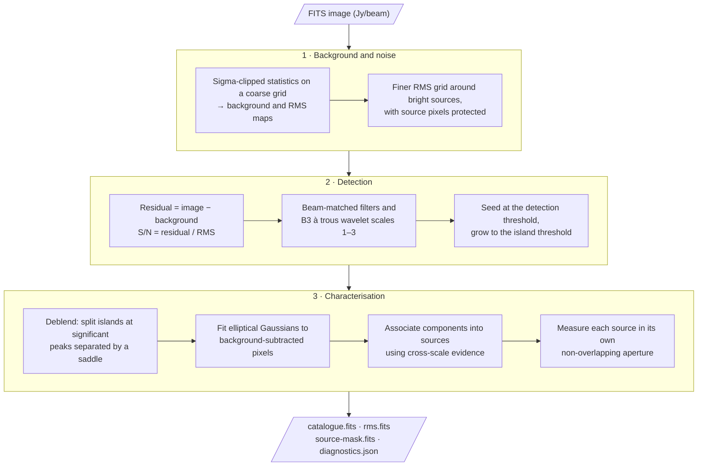

# How Hebog finds sources

This page is for astronomers who want to know what Hebog does to an image and
why. It follows one call to `hebog.find_sources()` from a FITS image to the
published catalogue. For field definitions and units, see the
[output reference](../reference/public-products.md). For how the same steps
are spread over many machines, see
[How Hebog distributes work](../architecture/distributed-execution.md).

## Overview

The approach belongs to the same family as PyBDSF and Aegean: estimate local
noise, threshold into islands, and fit Gaussians. It differs mainly in how it
treats extended emission, in reporting source flux from an aperture rather
than a sum of Gaussians, and in running every step on independent tiles. See
the [comparison with other source finders](source-finder-comparison.md).

## Three populations, not one

Hebog keeps three things apart that are easy to conflate:

| Term | Meaning | Catalogue table |
| --- | --- | --- |
| **Island** | A connected footprint in the published detection mask | `ISLANDS` |
| **Gaussian component** | One successfully fitted elliptical Gaussian | `GAUSSIAN_COMPONENTS` |
| **Source** | One or more detected components that Hebog associates as a single object in the image | `SOURCES` |

An island can hold several independent sources. A source can span several
islands. A detected component has no Gaussian row if its fit failed or was not
admissible. None of the three is automatically one astrophysical object.

## Step by step

### 1. Check the image

Hebog needs pixel values in `Jy/beam`, an ICRS or FK5 J2000 celestial WCS, a
restoring beam and a reference frequency. NaN pixels are allowed and are
excluded everywhere. Anything else is rejected before analysis, with an error
that says what is missing. [Capability and status](../reference/release-status.md)
lists the exact requirements, including the current 3,000-pixel size limit.

### 2. Estimate background and noise

The background (slowly varying offset) and the RMS (local noise) are estimated
separately:

- Iteratively sigma-clipped statistics are computed in windows on a coarse
  grid, then interpolated to every pixel.
- Pixels that belong to candidate sources are **protected**: they are excluded
  from the statistics, so bright or extended emission does not inflate the
  noise estimate around itself.
- Near bright sources, where noise changes quickly because of imaging
  artefacts, the `continuum` profile switches to a finer RMS grid.
- At image edges, fine RMS values are extended as constants, never
  extrapolated towards zero. Background and coarse-RMS slopes are taken from
  grid samples at least as far apart as the distance being extrapolated, so a
  genuine gradient is preserved without amplifying small errors.

In the reviewed `continuum` profile the coarse grid uses 150-pixel windows
every 50 pixels and the fine RMS grid 35-pixel windows every 7 pixels.
Windows that overlap protected sources are dropped and
the gaps interpolated; a region with no clean noise samples stays
unavailable rather than receiving an invented floor. Background refinement
around bright sources is triggered at 75σ, or at your detection threshold if
your island threshold is higher than that. This never changes your detection
or island thresholds. Noise structure finer than the grid is not measured.

If no pixel has a finite positive RMS, a sigma threshold has no meaning. Hebog
then returns an empty catalogue, a zero mask and an all-NaN RMS image marked
`unavailable`. This is **not** evidence of an empty sky. A noiseless
simulated image is the usual cause.

### 3. Detect compact and extended emission

Hebog forms the residual `image − background` and the signal-to-noise ratio
`residual / RMS`. Detection then uses two thresholds, as PyBDSF and Aegean do:

- a **detection threshold** (for example 5σ): an island must contain evidence
  at this level; and
- a lower **island threshold** (for example 3σ): an accepted island grows over
  eight-connected pixels down to this level.

To find emission that is faint per pixel but significant over a larger area,
Hebog also evaluates the residual through a bank of beam-matched filters and
a B3-spline à trous wavelet transform. These filtered images only help decide
*whether* a region is significant. Islands still grow on the original residual
pixels, and all fluxes are measured on the original image.

Two area rules apply. A region promoted only by a filter must cover a minimum
area in beams. A region with a pixel directly above the detection threshold
can be smaller. Your `minimum_island_pixels` and optional
`maximum_island_pixels` are applied afterwards.

Diffuse multiscale emission can enlarge the region used to measure a nearby
detection, but it is assigned to the nearest detection and cannot merge two
detections merely because their faint wings touch. Multiscale support is kept
only when it persists at an adjacent wavelet scale.

### 4. Deblend and fit Gaussians

Within each island Hebog looks for significant peaks separated by a
sufficiently deep saddle and splits the island into one region per peak.

Each component is then fitted with an elliptical Gaussian, initialised from
image moments and fitted to the original background-subtracted pixels.
Neighbouring components whose fitting regions touch are fitted jointly. A fit
is **admitted** only if it converged, stayed within physical bounds, is well
conditioned, leaves acceptable residuals and has usable uncertainties.
Depending on the data, the admitted model is a free ellipse, a beam-shaped
Gaussian, or an ellipse with a fixed centre.

Fitting work is bounded. An island too large or too complex for the bounded
deblend or joint fit is kept as a detection and recorded as **deferred** in
the diagnostics. It is never silently dropped.

### 5. Associate and measure sources

In the `continuum` profile, Hebog decides which components form one source
using a hierarchy of wavelet-scale features, the compact Gaussian models and
the emission left after subtracting them. Every merge is recorded with its
evidence in `diagnostics.json`. Components without positive evidence stay
independent.

Source flux is **not** the sum of member Gaussians. Each source owns a
non-overlapping aperture, and its flux is the signed sum of
background-subtracted pixels in that aperture. If that sum is not positive or
cannot be measured, the source gets no catalogue row; Hebog does not
substitute a positive-only estimate. The source position comes from the
detection footprint, not from faint measurement-only wings, so a centroid can
lie between two peaks or inside a ring.

In the `compact` profile, association is skipped: every fitted component is
its own source and carries its Gaussian measurement. Diagnostics then declare
`extended-emission-incomplete`.

### 6. Publish products

The mask is the retained detection footprint, and its connected regions are
the catalogue's islands. A Gaussian row is published only with its parent
source row. All four files are written to a private directory, validated, and
moved into place together, so a partial result is never visible.

Hebog does not publish its background map, residual or model images, wavelet
planes, or a filtered sky model.

## Detailed decision flow

The diagram below shows every accept or reject decision in the current
finder. Input and configuration failures stop before any scientific work. A
scientific rejection, such as an unseeded region or a rejected fit, does not
stop the run: the item is left out of the catalogue and, where it had an
identity, recorded in the diagnostics.

```mermaid
flowchart TD
    start([SourceFinderRequest, configuration, executor])
    config{Configuration valid?}
    destination{Output directory absent?}
    input{FITS readable and metadata supported?}
    reject_config([Reject invalid thresholds or profile])
    reject_destination([Refuse to overwrite caller-owned output])
    reject_input([Reject invalid unit, WCS, beam, frequency, shape, or size])

    start --> config
    config -- No --> reject_config
    config -- Yes --> destination
    destination -- No --> reject_destination
    destination -- Yes --> input
    input -- No --> reject_input
    input -- Yes --> partition[Plan deterministic background and detection tile cores]

    profile{Continuum or compact profile?}
    continuum[Source-protected background and adaptive local RMS]
    compact[Compact-profile background and RMS policy]
    rms[Reconcile tile estimates into background and RMS planes]
    usable{Any finite, positive RMS?}
    empty[Create empty catalogue, zero mask, and all-NaN unavailable RMS]

    partition --> profile
    profile -- Continuum --> continuum
    profile -- Compact --> compact
    continuum --> rms
    compact --> rms
    rms --> usable
    usable -- No --> empty

    residual[Subtract background; exclude invalid pixels; divide by local RMS]
    filters[Evaluate beam-aware matched filters and residual B3 à trous scales per tile]
    flood[Grow eight-connected candidate islands on original residual pixels at island threshold]
    seed{Candidate has detection-threshold evidence?}
    drop_unseeded[Discard unseeded region]
    area{Meets multiscale area rule or has a direct detection-threshold pixel?}
    drop_area[Discard unsupported sub-area region]
    own[Keep direct labels; assign nearby significant multiscale support to nearest seed owner]
    boundary[Refine boundaries with original-pixel S/N and adjacent-scale persistence; preserve owner bridges]
    configured_size{Within caller minimum and optional maximum pixel count?}
    drop_size[Discard component]
    any_component{Any component remains?}

    usable -- Yes --> residual
    residual --> filters
    filters --> flood
    flood --> seed
    seed -- No --> drop_unseeded
    seed -- Yes --> area
    area -- No --> drop_area
    area -- Yes --> own
    own --> boundary
    boundary --> configured_size
    configured_size -- No --> drop_size
    configured_size -- Yes --> any_component
    any_component -- No --> empty

    deblend{Parent is eligible for bounded deblending and has separable peaks?}
    split[Split into deterministic component owners]
    preserve[Keep one owner or record bounded-work deferral]
    fit{Gaussian model is measurable and scientifically admissible?}
    gaussian[Retain admitted Gaussian-component measurement]
    fit_absent[Keep detection identity; record unavailable or deferred fit]
    hierarchy[Build multiscale component hierarchy and association evidence]
    association{Profile allows source association?}
    associate[Choose independent, compact-model, or extended-morphology grouping]
    singleton[Use one source per component; declare extended-emission limitation]
    source_measure[Measure each source once with signed, non-overlapping owned aperture]
    source_valid{Positive, available source measurement with publication support?}
    compact_valid{Admitted component measurement with publication support?}
    source_row[Publish source row]
    source_absent[Keep source disposition without a catalogue row]

    any_component -- Yes --> deblend
    deblend -- Yes --> split
    deblend -- No --> preserve
    split --> fit
    preserve --> fit
    fit -- Yes --> gaussian
    fit -- No --> fit_absent
    gaussian --> hierarchy
    fit_absent --> hierarchy
    hierarchy --> association
    association -- Continuum --> associate
    association -- Compact --> singleton
    associate --> source_measure
    singleton --> compact_valid
    source_measure --> source_valid
    source_valid -- Yes --> source_row
    source_valid -- No --> source_absent
    compact_valid -- Yes --> source_row
    compact_valid -- No --> source_absent

    assemble[Build mask-connected islands and link sources and fitted components]
    bundle[Write and validate catalogue, RMS, mask, and diagnostics in a private bundle]
    publish{All four products valid?}
    success([Atomically rename complete bundle and return SourceFinderResult])
    fail([Leave requested output absent; caller may retry])

    source_row --> assemble
    source_absent --> assemble
    empty --> bundle
    assemble --> bundle
    bundle --> publish
    publish -- Yes --> success
    publish -- No --> fail
```

## Reading the results safely

- Use the catalogue and `diagnostics.json` together. The diagnostics list
  every detected component and source, including those without a catalogue
  row.
- Do not infer a Gaussian fit from a source row, or a blank sky from an empty
  catalogue.
- To compare with a PyBDSF or Aegean component list, use
  `GAUSSIAN_COMPONENTS`, not `SOURCES`.
- A successful run is not scientific qualification; see
  [capability and status](../reference/release-status.md#scientific-status).
